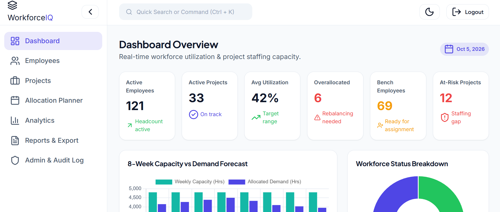

# WorkforceIQ - Smart Workforce Analytics & Resource Planning System

WorkforceIQ is a workforce analytics and resource planning platform designed to help resource managers and operations teams analyze employee utilization, forecast staffing capacity, resolve resource allocation conflicts, and identify best-fit talent for project requirements.

---

## Features

- Employee management and workforce tracking
- Project and resource management
- Employee allocation and capacity planning
- Workforce utilization analytics
- Department workload analysis
- 8-week capacity and demand forecasting
- Skill-gap analysis
- Best-fit resource recommendation engine
- Role-based access control (Admin, Manager, Viewer)
- Audit logging
- CSV reporting
- Interactive search and dashboards
- REST API-based backend

---

## Screenshots

### Dashboard



### Employee Management


### Resource Allocation


### Analytics


---

## Tech Stack

### Backend

- Java 17+
- Maven
- JDBC
- HikariCP
- Embedded Jetty 11
- Jakarta Servlets
- Gson
- SLF4J + Logback
- jBCrypt
- JJWT

### Database

- MySQL 8/9
- SQL schema and seed scripts
- Database views
- Stored procedures
- Triggers
- Audit logging

### Frontend

- HTML5
- CSS3
- Vanilla JavaScript ES6
- Chart.js
- Lucide Icons
- Responsive dashboard UI

### Testing

- JUnit 5
- DAO and service testing
- Validation testing
- Recommendation engine testing
- REST API CRUD testing

---

## System Architecture

```text
                    ┌─────────────────────┐
                    │   Web Browser       │
                    │ HTML/CSS/JavaScript │
                    └──────────┬──────────┘
                               │
                               ▼
                    ┌─────────────────────┐
                    │   Embedded Jetty    │
                    │   REST Servlets     │
                    └──────────┬──────────┘
                               │
                               ▼
                    ┌─────────────────────┐
                    │ Services / Business │
                    │      Logic          │
                    └──────────┬──────────┘
                               │
                               ▼
                    ┌─────────────────────┐
                    │ JDBC / HikariCP     │
                    └──────────┬──────────┘
                               │
                               ▼
                    ┌─────────────────────┐
                    │      MySQL          │
                    │   WorkforceIQ DB    │
                    └─────────────────────┘
```
